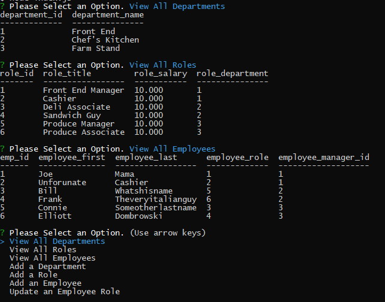
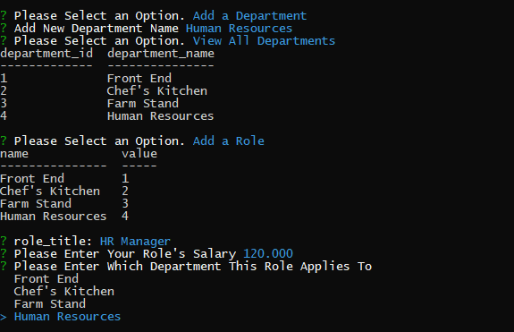

# MYSQL EMPLOYEE MANAGER

## This project is a command-line application for business owners to manage their departments, roles, and employees.

---

## USAGE

### To install and use this application, enter your MYSQL password into the 'index.js' file. Then, run 'npm install' followed by 'node index.js' from your command line within the application directory.

### Linked below is a video demonstrating the usage of this application.

### https://drive.google.com/file/d/1tIfdZ_8UqWx-Y2zrC5-EO3qvVCMSlyvo/view?usp=sharing

---

```md
AS A manager running a business, I want to manage and view my employees, role, and departments.
WHEN I choose to view all departments, roles, or employees, I am presented with a formatted table displaying the respective information.
WHEN I choose to add a new role, department, or employee, I am prompted to enter the respective information
THEN my new information is updated in the database.
WHEN I choose to update an employee,
THEN I am prompted to choose an employee to update, as well as their role.
THEN the employee's new information is updated in the database.
```

---

## SCREENSHOTS

### Provided below are screenshots of the application in use.



---



---

## FUTURE DEVELOPMENTS

### Future developments for this project include -

* Add features and respective prompts to update an employee's department
* Add features to remove an employee, department, or role.
* Add features to update an employee's salary.
* Implement validation in 'index.js' to refuse inputs with invalid data types.
* Format "update employee" prompt to display employee's full name instead of an employee id.